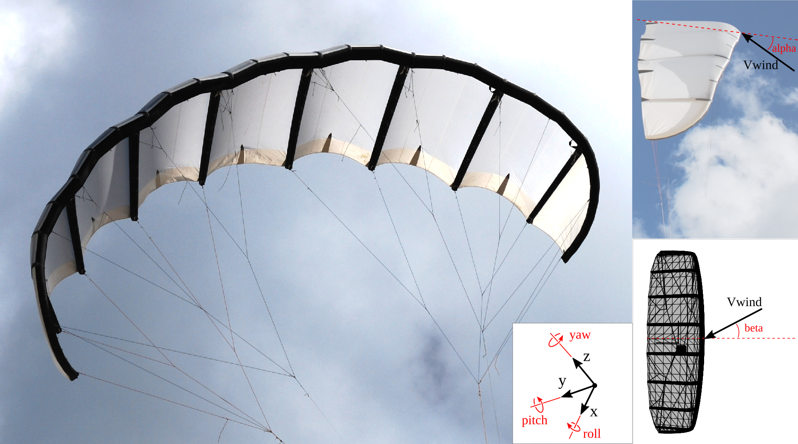

# 3D Aerodynamic Data
This folder contains aerodynamic data of the TUDELFT_V3_KITE. The CFD data includes lift, drag, and side-force coefficients as functions of angle of attack and sideslip angle. The measured wind tunnel data includes lift, drag, and side-force (CL, CD, CS) coefficients and roll, pitch, yaw moment coefficients (Mx, My, Mz) as functions of angle of attack and sideslip angle.

*Reference frame as used by Poland2025*
### Files
**CFD data:**
- [CFD_RANS_Re1e5_alpha_sweep_beta_0_Vire2020_CorrectedByPoland2025.csv](CFD_RANS_Re1e5_alpha_sweep_beta_0_Vire2020_CorrectedByPoland2025.csv)
- [CFD_RANS_Re1e5_alpha_sweep_beta_0_Vire2020_CorrectedByPoland2025.csv](CFD_RANS_Re1e5_alpha_sweep_beta_0_Vire2020_CorrectedByPoland2025.csv)
- [CFD_RANS_Re1e5_alpha_sweep_beta_0_Vire2022_CorrectedByPoland2025.csv](CFD_RANS_Re1e5_alpha_sweep_beta_0_Vire2022_CorrectedByPoland2025.csv)
- [CFD_RANS_Re1e5_beta_sweep_alpha_13_Vire2022_CorrectedByPoland2025.csv](CFD_RANS_Re1e5_beta_sweep_alpha_13_Vire2022_CorrectedByPoland2025.csv)
- [CFD_RANS_Re5e5_alpha_sweep_beta_0_Vire2020_CorrectedByPoland2025.csv](CFD_RANS_Re5e5_alpha_sweep_beta_0_Vire2020_CorrectedByPoland2025.csv)
- [CFD_RANS_Re1e6_alpha_sweep_beta_0_Vire2020_CorrectedByPoland2025.csv](CFD_RANS_Re1e6_alpha_sweep_beta_0_Vire2020_CorrectedByPoland2025.csv)
- [CFD_RANS_Re1e6_alpha_sweep_beta_0_Vire2022_CorrectedByPoland2025.csv](CFD_RANS_Re1e6_alpha_sweep_beta_0_Vire2022_CorrectedByPoland2025.csv)
- [CFD_RANS_Re1e6_beta_sweep_alpha_13_Vire2022_CorrectedByPoland2025.csv](CFD_RANS_Re1e6_beta_sweep_alpha_13_Vire2022_CorrectedByPoland2025.csv)
- [CFD_RANS_Re3e6_alpha_sweep_beta_0_Vire2020_CorrectedByPoland2025.csv](CFD_RANS_Re3e6_alpha_sweep_beta_0_Vire2020_CorrectedByPoland2025.csv)
- [CFD_RANS_Re3e6_alpha_sweep_beta_0_Vire2022_CorrectedByPoland2025.csv](CFD_RANS_Re3e6_alpha_sweep_beta_0_Vire2022_CorrectedByPoland2025.csv)
- [CFD_RANS_Re3e6_beta_sweep_alpha_13_Vire2022_CorrectedByPoland2025.csv](CFD_RANS_Re3e6_beta_sweep_alpha_13_Vire2022_CorrectedByPoland2025.csv)
- [CFD_RANS_Re15e6_alpha_sweep_beta_0_Vire2020_CorrectedByPoland2025.csv](CFD_RANS_Re15e6_alpha_sweep_beta_0_Vire2020_CorrectedByPoland2025.csv)
- [CFD_RANS_Re15e6_alpha_sweep_beta_0_Vire2022_CorrectedByPoland2025.csv](CFD_RANS_Re15e6_alpha_sweep_beta_0_Vire2022_CorrectedByPoland2025.csv)
- [CFD_RANS_Re15e6_beta_sweep_alpha_13_Vire2022_CorrectedByPoland2025.csv](CFD_RANS_Re15e6_beta_sweep_alpha_13_Vire2022_CorrectedByPoland2025.csv)

**WindTunnel data:**
- [WindTunnel_Re5e5_alpha_sweep_beta_0_Poland2025.csv](WindTunnel_Re5e5_alpha_sweep_beta_0_Poland2025.csv)
- [WindTunnel_Re5e5_beta_sweep_alpha_7_Poland2025.csv](WindTunnel_Re5e5_beta_sweep_alpha_7_Poland2025.csv)
- [WindTunnel_Re5e5_beta_sweep_alpha_13_Poland2025.csv](WindTunnel_Re5e5_beta_sweep_alpha_13_Poland2025.csv)

### The data are presented in the following format:
| alpha [deg] | beta [deg] | CL | CD | CS | Mx | My | Mz |

### Variables
- alpha: defined as the angle between the incoming flow vector and the vector from mid-span leading-edge to trailing-edge, projected on the z, x plane, so around the y axis.
- beta: defined as the angle between the incoming flow vector and the vector from mid-span leading-edge to the center of the model, projected on the y, x plane, so around the z axis.

Coefficients are defined as:
- CL: Lift coefficient = L / (0.5 * rho * V^2 * A)
- CD: Drag coefficient = D / (0.5 * rho * V^2 * A)
- CS: Side-force coefficient = S / (0.5 * rho * V^2 * A)
- CMx: Roll moment coefficient = Mx / (0.5 * rho * V^2 * A * c)
- CMy: Pitch moment coefficient = My / (0.5 * rho * V^2 * A * c)
- CMz: Yaw moment coefficient = Mz / (0.5 * rho * V^2 * A * c)

The WindTunnel files also contains additional columns with CL_ci, CD_ci, CS_ci, Mx_ci, My_ci, Mz_ci, which are 99% confidence intervals of the coefficients, see Poland2025 for more details.

Where:
- L: Lift force
- D: Drag force
- S: Side force
- A: Reference area
- rho: Air density
- V: Velocity
- c: Chord length 
- CMx: Roll moment
- CMy: Pitch moment
- CMz: Yaw moment

### Name Explanation
- CFD: Computational Fluid Dynamics
- RANS: Reynolds-Averaged Navier-Stokes
- WindTunnel: Wind tunnel load measurements
- Re: Reynolds number
- alpha_sweep: data over a varying angle of attack
- beta_sweep: data over a varying sideslip angle
- Vire2020: The CFD RANS numerical setup -for the V3 kite without struts- and a discussion of the data is presented in the paper:
    > *Viré, A., Demkowicz, P., Folkersma, M., Roullier, A., and Schmehl, R. (2020). Reynolds-averaged Navier-Stokes simulations of the flow past a leading edge inflatable wing for airborne wind energy applications. Journal of Physics: Conference Series, 1618, 032007. https://doi.org/10.1088/1742-6596/1618/3/032007*
- Vire2022: The CFD RANS numerical setup, and a discussion of the data is presented in the paper:
    > *Viré, A., Lebesque, G., Folkersma, M., and Schmehl, R.: Effect of Chordwise Struts and Misaligned Flow on the Aerodynamic Performance
    of a Leading-Edge Inflatable Wing, Energies, 15, 1450, https://doi.org/10.3390/en15041450, 2022.*
- Poland2025: The data are presented in the paper:
     > *Poland, J. A. W., van Spronsen, J. M., Gaunaa, M., and Schmehl, R.: Wind Tunnel Load Measurements of a Leading-Edge Inflatable Kite Rigid Scale Model, Wind Energ. Sci. Discuss. [preprint], https://doi.org/10.5194/wes-2025-77, in review, 2025.*
- CorrectedByPoland2025: The data are corrected by a 1.02° offset in the geometric angle of attack (the angle between the horizontal plane and the vector from mid-span leading-edge to trailing-edge). Furthermore the CS values, are non-dimensionalized by the projected area of the model, rather than the projected side area of the kite. Lastly, as a new axis system has been adopted, the orientation has been swapped, i.e. CS_new = -CS_old. The correction is presented in Poland2025.

