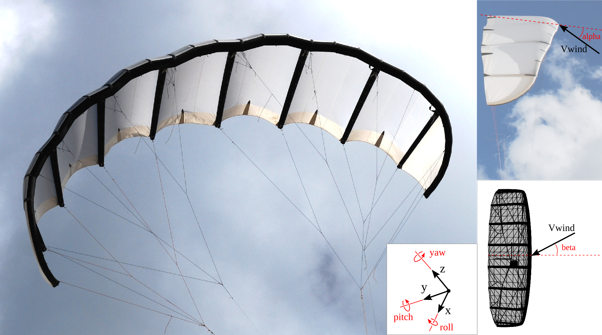

# Datasets {.unnumbered}

## General Properties
[in .yaml format](../data/properties.yaml)

| Property | TUDELFT_V3_KITE |
|----------|-------|
| Flat area (m²) | 25 |
| Number of struts (-) | 8 |
| Flat wing span (m) | 11.18 |
| Flat maximum chord (m) | 2.63 |
| Flat aspect ratio (-) | 5 |
| Projected area (m²) | 19.753 |
| Projected wing span (m) | 8.32 |
| Projected wing height (m) | 3.13 |
| Projected aspect ratio (-) | 3.498 |
| Side view area (m²) | 5.646 |
| Leading edge 3D length (m) | 11.302 |
| Trailing edge 3D length (m) | 11.249 |
| CoG wing in x-dir. (%) | 54 |
| CoG wing in z-dir. (%) | 34.3 |
| Ixx wing (kgm²) | 84.79 |
| Iyy wing (kgm²) | 13.23 |
| Izz wing (kgm²) | 83.01 |
| Ixz wing (kgm²) | -0.66 |
| Bridle height (m) | 9.60 |
| Number of bridle lines (-) | 82 |
| Total length bridle lines (m) | 96 |
| Number of pulleys in bridle | 0 |
| Wing and bridle mass (kg) | 10.6 |
| Nominal pulling force (N) | 5800 |

## Aerodynamic Data 
The CFD data includes lift, drag, and side-force coefficients as functions of angle of attack and sideslip angle. The measured wind tunnel data includes lift, drag, and side-force (CL, CD, CS) coefficients and roll, pitch, yaw moment coefficients (Mx, My, Mz) as functions of angle of attack and sideslip angle.

*Reference frame as used by Poland2025*

**CFD data:**
- [CFD_RANS_Re1e5_alpha_sweep_beta_0_Vire2020_CorrectedByPoland2025.csv](../data/aerodynamic/3D/CFD_RANS_Re1e5_alpha_sweep_beta_0_Vire2020_CorrectedByPoland2025.csv)
- [CFD_RANS_Re1e5_alpha_sweep_beta_0_Vire2020_CorrectedByPoland2025.csv](../data/aerodynamic/3D/CFD_RANS_Re1e5_alpha_sweep_beta_0_Vire2020_CorrectedByPoland2025.csv)
- [CFD_RANS_Re1e5_alpha_sweep_beta_0_Vire2022_CorrectedByPoland2025.csv](../data/aerodynamic/3D/CFD_RANS_Re1e5_alpha_sweep_beta_0_Vire2022_CorrectedByPoland2025.csv)
- [CFD_RANS_Re1e5_beta_sweep_alpha_13_Vire2022_CorrectedByPoland2025.csv](../data/aerodynamic/3D/CFD_RANS_Re1e5_beta_sweep_alpha_13_Vire2022_CorrectedByPoland2025.csv)
- [CFD_RANS_Re5e5_alpha_sweep_beta_0_Vire2020_CorrectedByPoland2025.csv](../data/aerodynamic/3D/CFD_RANS_Re5e5_alpha_sweep_beta_0_Vire2020_CorrectedByPoland2025.csv)
- [CFD_RANS_Re1e6_alpha_sweep_beta_0_Vire2020_CorrectedByPoland2025.csv](../data/aerodynamic/3D/CFD_RANS_Re1e6_alpha_sweep_beta_0_Vire2020_CorrectedByPoland2025.csv)
- [CFD_RANS_Re1e6_alpha_sweep_beta_0_Vire2022_CorrectedByPoland2025.csv](../data/aerodynamic/3D/CFD_RANS_Re1e6_alpha_sweep_beta_0_Vire2022_CorrectedByPoland2025.csv)
- [CFD_RANS_Re1e6_beta_sweep_alpha_13_Vire2022_CorrectedByPoland2025.csv](../data/aerodynamic/3D/CFD_RANS_Re1e6_beta_sweep_alpha_13_Vire2022_CorrectedByPoland2025.csv)
- [CFD_RANS_Re3e6_alpha_sweep_beta_0_Vire2020_CorrectedByPoland2025.csv](../data/aerodynamic/3D/CFD_RANS_Re3e6_alpha_sweep_beta_0_Vire2020_CorrectedByPoland2025.csv)
- [CFD_RANS_Re3e6_alpha_sweep_beta_0_Vire2022_CorrectedByPoland2025.csv](../data/aerodynamic/3D/CFD_RANS_Re3e6_alpha_sweep_beta_0_Vire2022_CorrectedByPoland2025.csv)
- [CFD_RANS_Re3e6_beta_sweep_alpha_13_Vire2022_CorrectedByPoland2025.csv](../data/aerodynamic/3D/CFD_RANS_Re3e6_beta_sweep_alpha_13_Vire2022_CorrectedByPoland2025.csv)
- [CFD_RANS_Re15e6_alpha_sweep_beta_0_Vire2020_CorrectedByPoland2025.csv](../data/aerodynamic/3D/CFD_RANS_Re15e6_alpha_sweep_beta_0_Vire2020_CorrectedByPoland2025.csv)
- [CFD_RANS_Re15e6_alpha_sweep_beta_0_Vire2022_CorrectedByPoland2025.csv](../data/aerodynamic/3D/CFD_RANS_Re15e6_alpha_sweep_beta_0_Vire2022_CorrectedByPoland2025.csv)
- [CFD_RANS_Re15e6_beta_sweep_alpha_13_Vire2022_CorrectedByPoland2025.csv](../data/aerodynamic/3D/CFD_RANS_Re15e6_beta_sweep_alpha_13_Vire2022_CorrectedByPoland2025.csv)

**WindTunnel data:**
- [WindTunnel_Re5e5_alpha_sweep_beta_0_Poland2025.csv](../data/aerodynamic/3D/WindTunnel_Re5e5_alpha_sweep_beta_0_Poland2025.csv)
- [WindTunnel_Re5e5_beta_sweep_alpha_7_Poland2025.csv](../data/aerodynamic/3D/WindTunnel_Re5e5_beta_sweep_alpha_7_Poland2025.csv)
- [WindTunnel_Re5e5_beta_sweep_alpha_13_Poland2025.csv](../data/aerodynamic/3D/WindTunnel_Re5e5_beta_sweep_alpha_13_Poland2025.csv)

**Variables**
The data are presented in the following format:
| alpha [deg] | beta [deg] | CL | CD | CS | Mx | My | Mz |

The WindTunnel files also contains additional columns with CL_ci, CD_ci, CS_ci, Mx_ci, My_ci, Mz_ci, which are 99% confidence intervals of the coefficients, see Poland2025 for more details.

Definitions of the variables:
- alpha: defined as the angle between the incoming flow vector and the vector from mid-span leading-edge to trailing-edge, projected on the z, x plane, so around the y axis.
- beta: defined as the angle between the incoming flow vector and the vector from mid-span leading-edge to the center of the model, projected on the y, x plane, so around the z axis.
- CL: Lift coefficient = L / (0.5 * rho * V^2 * A)
- CD: Drag coefficient = D / (0.5 * rho * V^2 * A)
- CS: Side-force coefficient = S / (0.5 * rho * V^2 * A)
- CMx: Roll moment coefficient = Mx / (0.5 * rho * V^2 * A * c)
- CMy: Pitch moment coefficient = My / (0.5 * rho * V^2 * A * c)
- CMz: Yaw moment coefficient = Mz / (0.5 * rho * V^2 * A * c)

Where:
- A: Reference area
- rho: Air density
- V: Velocity
- c: Chord length 

**Name Explanation**
- CFD: Computational Fluid Dynamics
- RANS: Reynolds-Averaged Navier-Stokes
- WindTunnel: Wind tunnel load measurements
- Re: Reynolds number
- alpha_sweep: data over a varying angle of attack
- beta_sweep: data over a varying sideslip angle
- Vire2020: The CFD RANS numerical setup -for the V3 kite without struts- and a discussion of the data is presented in the paper:
    > *Viré, A., Demkowicz, P., Folkersma, M., Roullier, A., and Schmehl, R. (2020). Reynolds-averaged Navier-Stokes simulations of the flow past a leading edge inflatable wing for airborne wind energy applications. Journal of Physics: Conference Series, 1618, 032007. https://doi.org/10.1088/1742-6596/1618/3/032007*
- Vire2022: The CFD RANS numerical setup, and a discussion of the data is presented in the paper:
    > *Viré, A., Lebesque, G., Folkersma, M., and Schmehl, R.: Effect of Chordwise Struts and Misaligned Flow on the Aerodynamic Performance
    of a Leading-Edge Inflatable Wing, Energies, 15, 1450, https://doi.org/10.3390/en15041450, 2022.*
- Poland2025: The data are presented in the paper:
     > *Poland, J. A. W., van Spronsen, J. M., Gaunaa, M., and Schmehl, R.: Wind Tunnel Load Measurements of a Leading-Edge Inflatable Kite Rigid Scale Model, Wind Energ. Sci. Discuss. [preprint], https://doi.org/10.5194/wes-2025-77, in review, 2025.*
- CorrectedByPoland2025: The data are corrected by a 1.02° offset in the geometric angle of attack (the angle between the horizontal plane and the vector from mid-span leading-edge to trailing-edge). Furthermore the CS values, are non-dimensionalized by the projected area of the model, rather than the projected side area of the kite. Lastly, as a new axis system has been adopted, the orientation has been swapped, i.e. CS_new = -CS_old. The correction is presented in Poland2025.

## Geometric Data
- [CAD .stp file, developed initiallt by G.Lebesque during his MSc project 2020, and later adjusted by J.A.W. Poland in 2025](../data/geometry/CAD/TUDELFT_V3_KITE_surface_mesh_with_edge_fillets.zip)
- [Surfplan Exported Geometry Files](../data/surfplan_export) which can be analyzed using [SurfplanAdapter](https://github.com/jellepoland/SurfplanAdapter).

## Flight Data 
- - [Oehler, J. et al.: Kite power flight data acquired on 24 March 2017, Dataset, 4TU.Centre for Research Data, 2018.](https://doi.org/10.4121/uuid:37264fde-2344-4af2-860c-effda9caa3e8)
- [Kite power flight data acquired on 8 October 2019](https://github.com/awegroup/Flightdata08102019) or [4TU link](https://data.4tu.nl/datasets/102f9f56-aecd-4460-8c69-a3f74138ae53) analyzed by [Cayon et al. 2025](https://doi.org/10.5194/wes-2024-182) and [Schelbergen and Schmehl (2024)](https://doi.org/10.5194/wes-9-1323-2024)

- Flight data 27-11-2023,Cayon et al. (2024a).
 

## Wind Tunnel Data 

- Zenodo doi to Load paper, and add code link
- Zendo doi to 

## Structural Results

..
