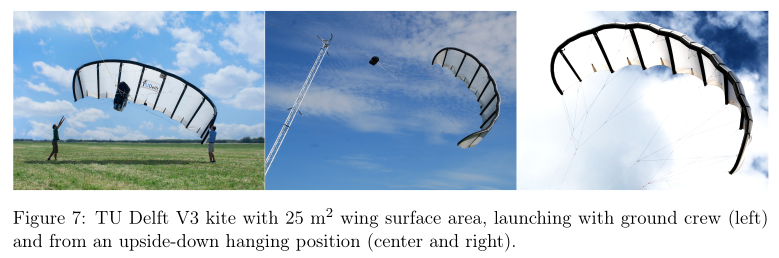
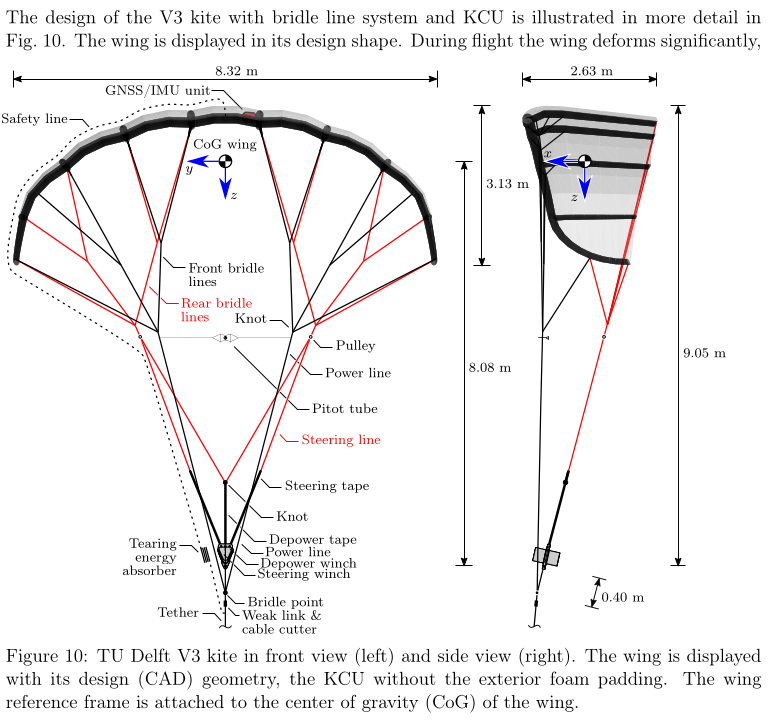
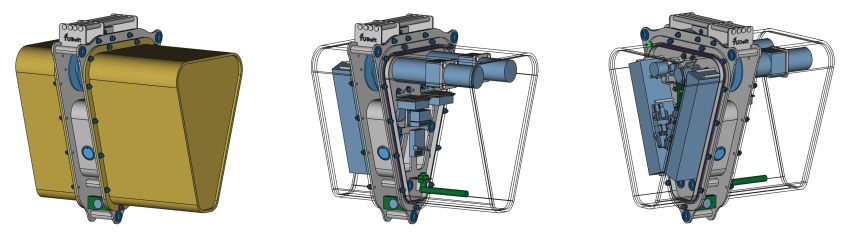

# More Info and Media {.unnumbered}

### System overview {.unnumbered}

### Flight path illustration
![[30]:  Friedl, F.: Fault-Tolerant Design of a Pumping Kite Power Flight Control System. M.Sc. Thesis,
FH Joanneum, University of Applied Sciences, Graz, Austria, 9 Feb 2015. http://resolver.tudelft.nl/uuid:e704e8aa-2371-437b-8de9-80b3b7067241
[31]: Salma, V., Friedl, F., Schmehl, R.: Improving Reliability and Safety of Airborne Wind Energy Systems. Wind Energy 23(2), 340–356 (2019). doi: 10.1002/we.2433](../data/images/flight_path_overview.png)

### Kite

### System Components

| Property | TUDELFT_V3_KITE |
|----------|-------|
| Flat area (m²) | 25 |
| Number of struts (-) | 8 |
| Flat wing span (m) | 11.18 |
| Flat maximum chord (m) | 2.63 |
| Flat aspect ratio (-) | 5 |
| Projected area (m²) | 19.753 |
| Projected wing span (m) | 8.32 |
| Projected wing height (m) | 3.13 |
| Projected aspect ratio (-) | 3.498 |
| Side view area (m²) | 5.646 |
| Leading edge 3D length (m) | 11.302 |
| Trailing edge 3D length (m) | 11.249 |
| CoG wing in x-dir. (%) | 54 |
| CoG wing in z-dir. (%) | 34.3 |
| Ixx wing (kgm²) | 84.79 |
| Iyy wing (kgm²) | 13.23 |
| Izz wing (kgm²) | 83.01 |
| Ixz wing (kgm²) | -0.66 |
| Bridle height (m) | 9.60 |
| Number of bridle lines (-) | 82 |
| Total length bridle lines (m) | 96 |
| Number of pulleys in bridle | 0 |
| Wing and bridle mass (kg) | 10.6 |
| Nominal pulling force (N) | 5800 |

### KCU details
The height (with tape guide), width and length of the KCU without exterior foam padding, as displayed in Fig. 15, is 32.7, 24.4 and 30.5 cm. Because of the space constraints under the shorter cover, the longer cover was quickly used on both sides, which increased the length without foam padding to 39 cm. With exterior foam padding this elongated but symmetric design had a height, width and length of 36, 30 and 53 cm, which takes into account the storage pouch for the progressive-tearing energy absorber.

In the considered time frame from 2010 until 2015, the mass of the KCU increased from initially 5 to 8.4 kg. The mass of the KCU including weak link and entire bridle line system, but excluding wing-mounted sensors and Pitot sensor, is 9 kg. The KCU is connected with
the ground control computer via a fast and a separate slow wireless link. The link quality (latency) was recorded during the test flights. A fixed data rate of 20 Hz in both directions was used. The data from the angular encoders were recorded, as were the motor temperatures and the battery voltage.

### Tether details

The tether is a 16-strand plaited hollow braid rope made of Dyneema® SK75, with a diameter of 4 mm, a mean breaking load of 13.5 kN, a mean breaking strain of 3.5% and a mass of 0.91 kg per 100 m.

### Other

[flight-path-animation](https://delftxtools.tudelft.nl/AE4T40_Airborne_Wind_Energy/cycle/kiteV3_total_crosswind.html)

[threejs model, with a "save to SVG" button](https://delftxtools.tudelft.nl/AE4T40_Airborne_Wind_Energy/threejs/kiteV3_static.html)